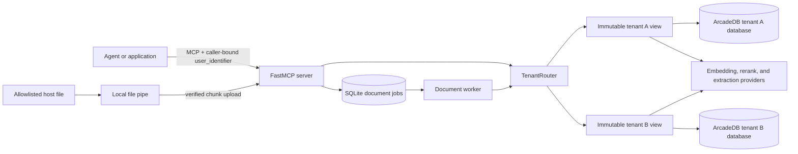

# Architecture

Turing AgentMemory MCP is a tenant-scoped memory and cited-document service for
agents. FastMCP is the tool boundary. ArcadeDB is the canonical graph, text, and
vector store, with one physical database per exact `user_identifier`. SQLite
persists the pseudonymous tenant registry and asynchronous document jobs.

## System Context



The foreground MCP tools and background document worker use the same
`StoreResolver` contract. A job records its validated tenant and resolves a
tenant-bound store only after the worker claims it; no global client is mutated
and no context-local database selection is used.

## Tenant Routing and Provisioning

Every production operation follows this sequence:

1. `validate_user_identifier` rejects empty values, control characters, invalid
   Unicode, and surrounding whitespace. Identifiers remain exact,
   case-sensitive Unicode; they are never trimmed, case-folded, or normalized.
2. `derive_tenant_database_identity` applies domain-separated HMAC-SHA-256 with
   the dedicated naming key. The locked name format is
   `agentmem_t_v1_<full lowercase digest>`.
3. `TenantRegistry` records only the opaque name, digest, lifecycle state, and
   timestamps. Its metadata pins the naming version and key fingerprint. Raw
   tenant identifiers are never persisted in the registry.
4. `TenantProvisioner` reconciles first use. It creates the database, bootstraps
   schema and indexes, writes one immutable `TenantManifest`, verifies that
   manifest, and marks the registry row `ready` last.
5. `TenantRouter` single-flights same-tenant first use and returns an immutable
   `TenantStoreView` whose `ArcadeDBClient` is permanently bound to that
   database. The view's store also carries a `TenantBinding`, a keyed digest
   recomputable from `(user_identifier, naming_key)` through the same
   `derive_tenant_database_identity` path used to name the database. A bounded
   LRU and idle TTL reuse views without owning database lifetime.
6. `TuringAgentMemory` verifies the caller-supplied `user_identifier` against
   that `TenantBinding` before any database or telemetry activity, then still
   binds it as an explicit predicate in every applicable query and mutation
   inside that database.

Unrelated tenants can provision concurrently. Cache eviction removes only a
local view; active references remain valid and the durable database is neither
closed nor dropped. A new view reopens the same database and verifies its
manifest. If a registry row is already `ready` but its database is missing, the
resolve fails closed instead of creating an empty replacement.

This is defense in depth:

- physical separation limits each client to one tenant database;
- the registry and immutable manifest detect missing or mismatched state;
- the `TenantBinding` check detects a misrouted or foreign identifier before
  any client, span, or audit activity runs, and mandatory `user_identifier`
  predicates prevent cross-tenant access even if a client is accidentally
  misrouted.

## Canonical Store and Retrieval

`TuringAgentMemory` owns graph writes, native vector loads, hybrid retrieval,
lifecycle operations, retention filtering, and audit hooks. Canonical memories,
documents, chunks, entities, facts, communities, full-text indexes, and vector
indexes live in the tenant's ArcadeDB database.

Memory retrieval can combine episode vectors, facts, entities, native Lucene
lexical matches, graph neighbors, and Leiden communities. Document retrieval
combines native vectors and lexical matching with metadata filters, page-aware
citations, neighbor context, and optional reranking. All channels retain the
tenant predicate before candidates leave the store.

The default Compose stack runs the revision-pinned GLiNER2 ONNX sidecar on CPU.
Entity, fact, temporal, and Leiden community records are derived but remain in
the same tenant database and carry the same tenant predicate.

## Asynchronous Document Pipeline

File ingestion separates request latency from conversion and indexing:

1. The caller supplies a runtime-local file or streams an allowlisted host file.
2. The MCP verifies byte count, chunk order, and SHA-256.
3. `DocumentIngestManager` atomically copies the file to durable staging.
4. `DocumentJobStore` records a tenant-scoped, idempotent job and returns
   `job_id`.
5. A background worker claims the job with an expiring, renewable lease and
   resolves its tenant through the production router.
6. PDFium extracts page-aware PDF text; MarkItDown handles other supported
   formats.
7. The tenant-bound store commits canonical document and chunk records.
8. The job becomes `succeeded` only after the canonical write returns.
9. Successful or canceled jobs remove staged bytes. Retryable failures retain
   them while the job remains eligible for retry.

Idempotency uses tenant, document identity, filename, and file digest. A stale
worker lease becomes claimable after process restart.

## Data Model

Each tenant database contains the same schema:

```text
(:User)-[:HAS_MEMORY]->(:Memory)
(:User)-[:HAS_DOCUMENT]->(:Document)-[:HAS_CHUNK]->(:Chunk)
(:Chunk)-[:NEXT_CHUNK]->(:Chunk)
```

Every canonical and derived tenant record carries `user_identifier`. Stable
application IDs make retries idempotent and keep vector IDs deterministic.

## Consistency, Durability, and Health

- ArcadeDB is authoritative for tenant content and native search indexes.
- The tenant registry, document job database, and staged files live on the
  persistent `/turing` application-state volume. The ArcadeDB databases live on
  the separate `arcadedb-data` volume.
- The registry is durable control state, not a reversible tenant catalog. It
  must be backed up with the naming key and restored consistently.
- A successful ArcadeDB restart makes existing databases and data reachable
  without `load_graph`, manual recreation, or cache preservation.
- `/health` is layered: top-level readiness requires the shared ArcadeDB probe
  and tenant registry; the response also reports ArcadeDB, registry, router,
  cache, in-flight, and document-worker state. A damaged tenant manifest fails
  that tenant's operation without marking every tenant unhealthy.

## Trust Boundaries

The host application authenticates the human or service and supplies the
allowed `user_identifier`. Static MCP tokens authenticate clients but do not
bind a token to one tenant. A production gateway must derive or validate the
identifier; model output must never select it. Retrieved text is untrusted
evidence and cannot gain instruction priority when it re-enters an agent prompt.

Logs, status, registry records, and provisioning errors expose opaque database
names and key fingerprints for operator correlation, not raw tenant identifiers.
An operator who already knows an exact identifier can compute its expected
database name locally with the deployment key.

## Deployment Boundaries

The provided Compose stack pins `arcadedata/arcadedb:26.7.1`, persists ArcadeDB
and application control state on named volumes, and keeps model sidecars private.
Only loopback development ports are published. Production deployments should
put TLS and caller-to-tenant authorization in a reverse proxy or service mesh.

OIDC-derived tenant identity, naming-key rotation and database migration,
tenant offboarding or deletion, cross-tenant reporting, placement across an
ArcadeDB fleet, and fleet-wide dormant-database schema rollout are explicitly
deferred. This phase exposes no production database-deletion API.
