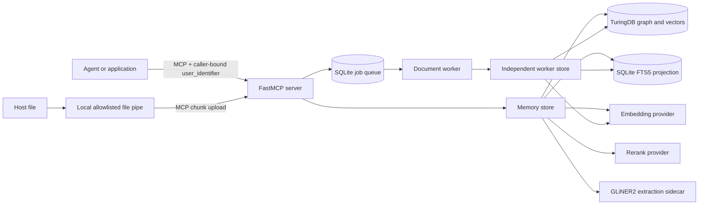

# Architecture

Turing AgentMemory MCP is a tenant-scoped memory and cited-document service for
agents. FastMCP exposes the tool boundary. TuringDB stores canonical graph
records and vector indexes. SQLite provides recoverable local projections and a
durable document job queue.

## System Context



## Components

### MCP server

`server.py` creates the FastMCP application. It validates tool inputs, applies
tenant scope to every operation, exposes `/health`, and delegates storage to
`TuringAgentMemory`. HTTP authentication is optional and disabled unless static
tokens are configured.

### Canonical store

`TuringAgentMemory` owns graph writes, vector loads, hybrid retrieval, lifecycle
operations, retention filtering, and audit hooks. Canonical records live in
TuringDB. SQLite FTS5 is a rebuildable read projection, not a second source of
truth.

### Retrieval pipeline

Memory retrieval can combine episode vectors, facts, entities, BM25, graph
neighbors, and Leiden communities. Document retrieval combines tenant-specific
vectors with lexical matching, metadata filters, page-aware citations, neighbor
context, and optional reranking. Query filters apply before results leave the
store.

### Extraction and community projections

The default Compose stack runs the revision-pinned GLiNER2 ONNX sidecar on CPU.
The store can derive typed entities, facts, and temporal relationships from
stored messages. Native Leiden community detection builds a derived graph
projection. These projections remain tenant-scoped and can be rebuilt from
canonical data.

### Asynchronous document pipeline

File ingestion separates request latency from conversion and indexing:

1. The caller sends a runtime-local file or streams an allowlisted host file.
2. The MCP verifies byte count, ordered chunks, and SHA-256.
3. The manager atomically copies the file to durable staging.
4. SQLite records a tenant-scoped, idempotent job and returns `job_id`.
5. One background worker claims the job with an expiring lease.
6. PDFium extracts page-aware PDF text. MarkItDown handles other supported
   formats.
7. The worker embeds chunks, commits bounded graph batches, and loads vectors.
8. The job becomes `succeeded` only after the canonical write returns.
9. Successful or canceled jobs remove staged bytes. Failed jobs retain them for
   an approved retry.

The worker renews its lease on a cadence during long provider and TuringDB
calls. After a process restart, a stale `running` lease becomes claimable again.
Idempotency is derived from tenant, document identity, and file digest.

## Data Model

Core ownership edges are:

```text
(:User)-[:HAS_MEMORY]->(:Memory)
(:User)-[:HAS_DOCUMENT]->(:Document)-[:HAS_CHUNK]->(:Chunk)
(:Chunk)-[:NEXT_CHUNK]->(:Chunk)
```

Derived records include entities, facts, temporal relationships, and
communities. Every canonical and derived record carries `user_identifier`.
Stable application IDs prevent duplicate writes and keep vector IDs
deterministic.

## Consistency and Durability

- TuringDB is authoritative for memory, document, entity, fact, and community
  records.
- Vector and FTS projections are recoverable from canonical records.
- The document queue and staging files share the durable `/turing` volume with
  TuringDB data.
- Each dependent graph batch is submitted before the next batch. TuringDB does
  not expose nodes created in an unsubmitted change to a later `MATCH`.
- Searchable document status is returned only after graph and vector operations
  complete.
- Job state does not imply application-level answer quality. Integrators should
  verify important content with `document_search`.

## Trust Boundaries

The system has four distinct trust decisions:

1. The host application authenticates the human or service.
2. The host maps that principal to `user_identifier`.
3. The MCP enforces that identifier on graph, vector, and FTS operations.
4. The consuming agent treats retrieved text as untrusted evidence.

Static MCP tokens authenticate clients but do not bind a token to one tenant.
A production gateway must derive or validate `user_identifier`; never let model
output select it. Retrieved text can contain prompt injection and must not gain
instruction priority.

## Deployment Topology

The provided Compose stack runs TuringDB, MCP, embedding, rerank, GLiNER2, and
optional Lab services on one private network. Only TuringDB, MCP, and Lab bind
to loopback host ports. Model sidecars have no host ports. Production deployments
should put TLS and identity enforcement in a reverse proxy or service mesh and
keep TuringDB and model providers private.
